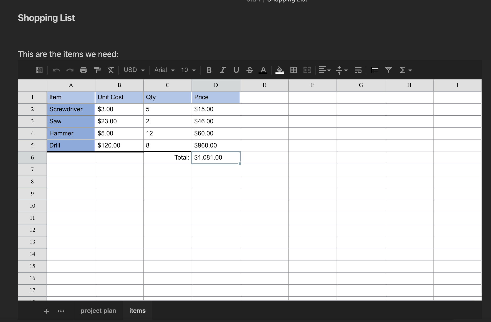

# Obsidian Sheets



This plugin enables to work with tabular data directly in Obsidian: either storing data in the note itself, or on an external Excel or CSV file.
The following files are supported:
- XLSX
- XLS
- CSV


## Code Block Parameters

In order to create a sheet it is enough to create a code block with the `sheet` name

~~~markdown
```sheet

```
~~~

Following is the complete list of properties with their default values:

~~~YAML
```sheet
filename: <path relative to vault root>
enableSave: <value in settings>
autoSave: <value in settings>
height: 540
width: "auto"
rows: 100
cols: 26
fontSize: 10
cellHeight: 25
cellWidth: 100
```
~~~


If `filename` is provided, data is loaded from that file, if already existing. Otherwise it will be created upon save.
If `filename` is not provided, data will be stored in the code block itself.

Note that by default saving data to external files is disabled because - in general - there will be loss of information. This could be enabled at vault-level via the settings, or code-block level by specifying `enableSave: true` in the code block.
When saving to file, by default it will also autosave after each modification. When saving to the code block in order to save one must click the save icon in the top left.

## Supported Formats

When saving to code block, all formatting and changes done to the sheet are perserved.
When saving to `XLSX` most formatting and data will be saved and read back. Note however that when reading an existing `XLSX` file, only a subset of functionality will be supported. 
Support of `XLS` is limited to data and cell merges
CSV can, of course, only store data.


## Attributions

This plugin uses the following libraries:

https://github.com/SheetJS

https://github.com/myliang/x-spreadsheet (forked here: https://github.com/Canna71/x-spreadsheet)

https://github.com/exceljs/exceljs
